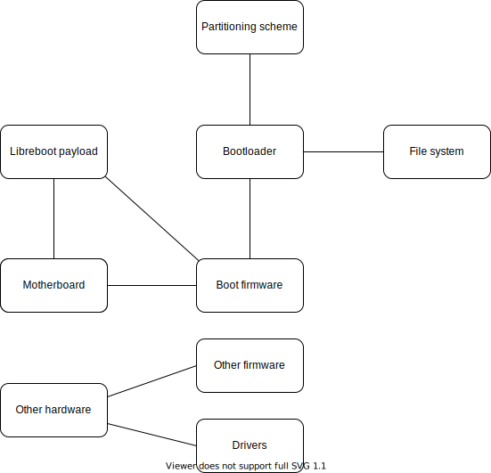

The edges of this graph represent "mutual dependency" in the choice to make.

# Hardware
Depends on:
- your requirements
- the firmwares you want to use
- the drivers you want to use

Tightly linked to the 4 following sections.

# Boot firmware
Tightly linked to the choice of motherboard and bootloader, see https://libreboot.org/docs/hardware/
3 methods:
- keep the firmware that comes with your motherboard
- get the motherboard flashed by someone else* (see https://libreboot.org/suppliers.html)
- flash it yourself* (see https://libreboot.org/docs/install/spi.html)

\* Only available for some motherboards, you can choose:
- manual Coreboot install (very hard)
- Libreboot (Coreboot distribution)

Most UEFI-based systems have a legacy BIOS functionality integrated in the UEFI system firmware, it provides a backward compatibility mode.

# Payload (only for Libreboot/Coreboot)
See https://libreboot.org/docs/install/#payload-names

# Other firmwares
Tightly linked to the choice of hardware. See https://libreboot.org/faq.html#what-other-firmware-exists-outside-of-libreboot

# Drivers
Tightly linked to the choice of hardware. Choose from https://h-node.org/hardware/catalogue/en and https://ryf.fsf.org/products if you want libre-only drivers.

# Bootloader
Tightly linked to the choice of file system, boot firmware, and partitioning scheme. You need to identify first if your boot firmware is compatible with the UEFI standard, see https://itsfoss.com/check-uefi-or-bios/

Then, use this to choose your bootloader: https://wiki.archlinux.org/title/Arch_boot_process#Feature_comparison

You can then choose your kernel parameters (for hibernation, compression...) here https://wiki.archlinux.org/title/kernel_parameters

# Partitioning scheme

Tightly linked to the choice of bootloader, according to the bootloader table above. GPT is more recent than MBR. See https://wiki.archlinux.org/title/partitioning#Choosing_between_GPT_and_MBR

# File system

Tightly linked to choice of bootloader. See bootloader comparison table and this https://wiki.archlinux.org/title/file_systems#Types_of_file_systems

# Kernel

You can choose one of the pre-configured kernels here https://wiki.archlinux.org/title/kernel#Officially_supported_kernels and here https://www.fsfla.org/ikiwiki/selibre/linux-libre/

Or you can configure it yourself https://wiki.gentoo.org/wiki/Kernel/Configuration

This is where you choose if you want to use SELinux, and where you choose the drivers you need.

# Initramfs config

See https://wiki.archlinux.org/title/mkinitcpio#Configuration

Tightly linked to the init software, this is where you should choose the right hooks https://wiki.archlinux.org/title/mkinitcpio#Common_hooks

# Init software

See https://wiki.archlinux.org/title/init for comparison.

# Wayland vs X

See https://en.wikipedia.org/wiki/Wayland_(display_server_protocol)#Differences_between_Wayland_and_X

# Display manager
In general, linked to the desktop environment. See https://wiki.archlinux.org/title/display_manager#List_of_display_managers and here https://wiki.archlinux.org/title/wayland#Display_managers for compatibility with Wayland.

# Window manager
In general, linked to the desktop environment. See https://wiki.archlinux.org/title/Window_manager#Types and here https://wiki.archlinux.org/title/wayland#Compositors for compatibility with Wayland.

# Desktop environment

See https://wiki.archlinux.org/title/Desktop_environment#List_of_desktop_environments

# Other choices

- Locale https://wiki.archlinux.org/title/locale
- System time https://wiki.archlinux.org/title/System_time
- NTP software https://chrony.tuxfamily.org/comparison.html
- Time server https://tf.nist.gov/tf-cgi/servers.cgi
- DNS https://privacytools.io/providers/dns/ and https://wiki.archlinux.org/title/Domain_name_resolution
- Pacman mirror https://wiki.archlinux.org/title/reflector
- Key server https://wiki.archlinux.org/title/GnuPG#Key_servers
- Doas vs Sudo https://wiki.archlinux.org/title/Doas
- Shell https://wiki.archlinux.org/title/Command-line_shell
- Other apps https://wiki.archlinux.org/title/List_of_applications
